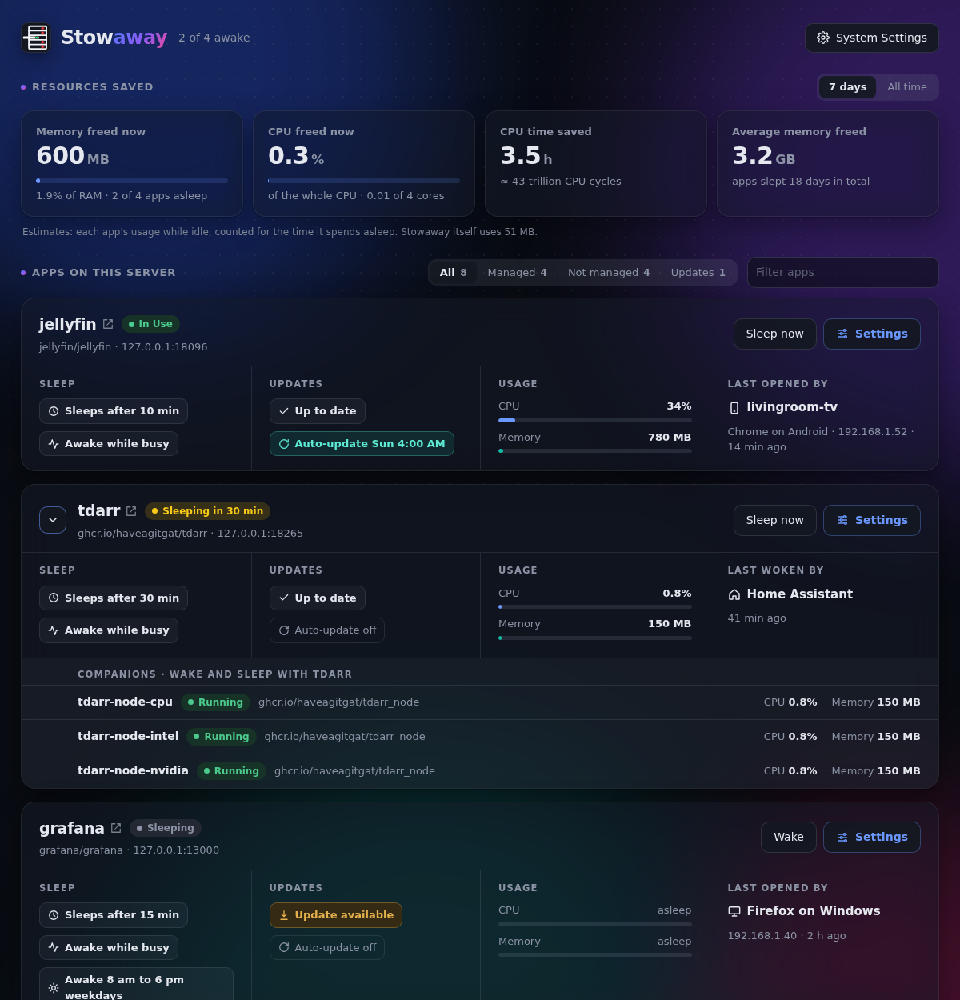
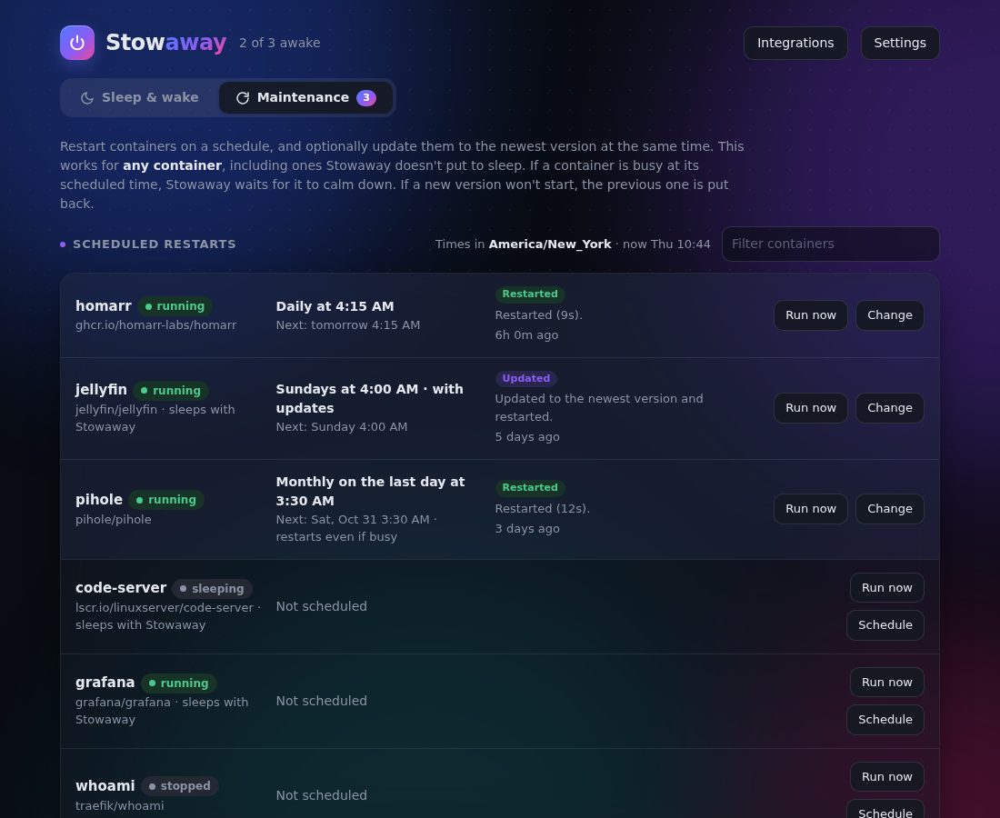
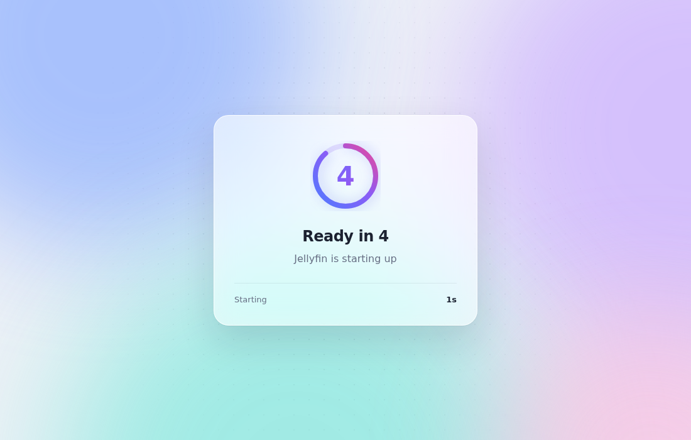

# Stowaway

[](https://github.com/Sat32blk/Stowaway/actions/workflows/docker-image.yml)
[](LICENSE)
[](https://buymeacoffee.com/sat32blk)

**Stowaway is the middleman between your favorite dashboard or bookmark and your containers' web interfaces.**

Plenty of containers only get used now and then: a photo editor you open once a week, a game server for the weekend, the media tools you reach for occasionally. There's no reason for them to run 24/7, using memory and CPU while nobody's looking. With Stowaway, your link still opens the app as usual. If the app is asleep, Stowaway starts it and shows a short "starting" page, then sends you straight in. Once nobody has used it for a while, Stowaway puts it back to sleep.

It's also great for trying things out. Install as many containers as you like without worrying about them eating up your server's resources: the ones you're not using just sleep.

Everything is managed from a web dashboard that lists every container on your server. Tick **Enable Stowaway** on the ones it should manage, and it shows you how much memory and CPU it's saving.



- **Wake on demand:** a start page while the app wakes, then straight into the app. Media apps on TVs, API clients and live connections (WebSockets) work too.
- **Never sleeps a busy app:** CPU and network activity count as use. Keep apps awake on demand or during set hours.
- **Resources saved:** see how much memory and CPU sleeping apps are freeing.
- **Updates on wake:** optionally install a newer image when an app wakes, and go back to the old one if the new one won't start.
- **Scheduled maintenance:** restart (and optionally update) any container daily, weekly or monthly.
- **Fits your setup:** macvlan/ipvlan containers, HTTPS with Let's Encrypt, status for Homarr, Homepage, Dashy, Glance and Heimdall, and a [Home Assistant integration](https://github.com/Sat32blk/Stowaway-homeassistant).
- **Light:** about 40 MB of memory and under 0.1% of one CPU core while idle.

| | |
|---|---|
|  |  |

```
link / Heimdall / Homarr tile ──► stowaway ──► asleep? ── yes ──► docker start, show "Starting…" page
                                               │                    (reloads by itself when ready)
                                               └── awake ──► pass the request through, reset the idle timer

every 5s: anything idle longer than its timeout, with nothing in progress ──► docker stop
```

## Install

Stowaway runs on any Linux server or NAS with Docker: OpenMediaVault, Synology, Unraid, TrueNAS SCALE, QNAP, UGREEN, Asustor, CasaOS/ZimaOS, or a plain Debian/Ubuntu box, on Intel/AMD (amd64) or 64-bit ARM (arm64). See [NAS platforms](#nas-platforms) for step-by-step notes for each.

**With the ready-made image** (easiest; works in NAS compose screens that can't build images). Paste this as a compose project, changing the `/config` folder to one on your NAS:

```yaml
services:
  stowaway:
    image: ghcr.io/sat32blk/stowaway:latest
    container_name: stowaway
    restart: unless-stopped
    network_mode: host
    # Needed only for macvlan containers: uncomment cap_add/NET_ADMIN
    # and MACVLAN_HELPER_IP (a free address on your network).
    # cap_add:
    #   - NET_ADMIN
    environment:
      - DASHBOARD_PORT=8880
      - TZ=America/New_York
      # - MACVLAN_HELPER_IP=192.168.1.250
    volumes:
      - /var/run/docker.sock:/var/run/docker.sock
      - /srv/stowaway:/config
```

**From the source** (clone the repository or unzip a release):

```bash
cd /opt
unzip stowaway.zip        # or: git clone https://github.com/Sat32blk/Stowaway.git stowaway
cd stowaway
docker compose up -d --build
```

Open **http://<server-ip>:8880** from a device on your home network. The first visit asks you to create a username and password; the password needs at least 8 characters including a letter, a number and a special character. After that you sign in with it.

**Forgot your password?** On the server run `docker exec stowaway python -m app.auth reset`, then open the dashboard again to create a new account. Your apps and settings are kept.

Keep the container named `stowaway` (so it doesn't list itself as an app), or set `STOWAWAY_SELF` to the name you use.

## Using it

1. In **Containers on this server**, tick **Enable Stowaway** next to an app.
2. Check the suggested ports and click **Enable Stowaway**. The checkbox then reads **Stowaway Enabled**:
   - **Link port** is the new address that wakes the app, e.g. `http://192.168.1.2:18096`. Put this in Heimdall, Homarr or a bookmark.
   - **App port** is the port the app listens on inside its container. It's filled in from the container's settings.
   - **Put it to sleep** *automatically* after a number of idle minutes, or *only when I say so* (Home Assistant, the API or by hand).
3. The app now appears under **Controlled by Stowaway** with a countdown to sleep, plus Open, Wake, Sleep now and Edit buttons.

Untick **Stowaway Enabled** to hand a container back. Stowaway offers to start it if it's asleep so it runs normally again.

Stowaway never modifies your containers (so OMV's Compose page won't undo anything). The app's own port keeps working while it's awake; only the link port wakes it.

## Companion containers

Some apps come with helper containers that are useless on their own, like Tdarr and its `tdarr-node-cpu`, `tdarr-node-intel` and `tdarr-node-nvidia` nodes. Enable Stowaway on the main app only, and under **Companion containers** in its settings tick the helpers. Containers from the same compose project are listed first.

- **Waking:** companions start right after the app wakes.
- **Sleeping:** they go to sleep with it.
- **Activity counts:** if a companion is busy (say, a node transcoding), the app stays awake even when its own web interface is idle.
- **In the container list:** companions show **With tdarr** instead of their own *Enable Stowaway* box.

## Resources saved

The top of the dashboard shows what sleeping apps save:

- **Memory freed now** and **CPU freed now:** what the apps asleep right now would be using if they were awake and idle, and how much of the server's RAM and CPU that is.
- **CPU time saved** over the last 7 days or all time, also shown as CPU cycles, and **Average memory freed** over the same period.

The note under the tiles also shows what **Stowaway itself** uses, so you can see it's worth it. It's built to be light: about 40 MB of memory and under 0.1% of one CPU core while idle (measured with five apps, three of them awake). It follows Docker's event stream instead of repeatedly asking Docker about every app, checks CPU and network use of awake apps every 15 seconds (and once more right before putting one to sleep), and only loads its HTTPS code when HTTPS is turned on.

These are estimates. A stopped app uses nothing, so Stowaway learns what each app uses while it's awake but idle (not busy, and at least a minute after starting), and counts that as saved for every second the app sleeps. An app shows as *still learning* until it has run idle for a couple of minutes. Figures are kept in `config/savings.json`.

## Start page, ready delay and error page

**Settings → Start page** controls what visitors see while a sleeping app starts:

- **Style:** Please Wait, Starting Service, Loading *app name*, Ready in 3, 2, 1 (a countdown based on how long the app took last time), or a **Custom message** where `%name%` becomes the app's name.
- **Ready delay:** seconds to wait after the app answers before opening it. Useful for apps that accept connections a moment before they're fully ready.
- **Preview start page / Preview error page** show them without touching any container.

Each app can override the style and delay under **Edit → Advanced**.

If an app fails to start, the start page turns into an error page showing the reason, with **Try again** and **Open dashboard** buttons.

## Updating apps when they wake

Turn it on per app under **Edit → Updates → Check for a newer version when waking**. When the app is woken, Stowaway asks the image's registry (e.g. Docker Hub) whether the tag it uses, such as `jellyfin/jellyfin:latest`, now points to a newer version. If so:

1. Visitors see an **Updating** page with a progress bar while the new version downloads.
2. Stowaway swaps the container for one built from the new image, keeping its name, environment, labels, restart policy, ports, volumes (including anonymous ones), networks, IP addresses and MAC address. Settings that came from the old image itself are left to the new image, so its new defaults apply.
3. The page hands over to your chosen start page and then opens the app.

If the new version won't start, Stowaway puts the previous container back, points the image name back at the working version (so a `docker compose up` doesn't pick up the broken one), shows a note on the app's card, and won't try that version again. **Try again next wake** on the card clears that.

- **Check at most every** (default 24 hours) limits how often the registry is asked; 0 checks on every wake. **Check now** in the Edit dialog checks without installing.
- If the registry can't be reached, the app just starts on its current version.
- Updates on wake only happen while an app is asleep, never while it's running. (Scheduled maintenance, below, can also update apps that are running.)
- Pinned images (`image@sha256:…`) and images built on the server are never updated.
- **Private registries:** uncomment the `config.json` line in `docker-compose.yml` so Stowaway can use the server's `docker login`.
- **Be choosy:** `:latest` can bring big version jumps. For apps where that matters, use a tag like `jellyfin/jellyfin:10.10` so updates stay within that version line, or leave updating off.
- Docker Hub limits anonymous downloads (checks don't count), so daily checks are fine.

## Scheduled maintenance (restarts and updates)

The **Maintenance** tab is separate from sleeping and waking: it lists **every container** on the server, including ones Stowaway doesn't control, and lets you restart them on a schedule. Click **Schedule** on a container:

- **Restart:** every day, every week (pick the day) or every month (pick a date from the 1st to the 28th, or *Last day of the month*), at a time you choose. Monthly is the longest interval. Times use the time zone in **Settings**.
- **Also update to the newest version:** uses the same update process as *Updating apps when they wake*. The new version downloads while the container keeps running, so it's only down for the swap. Settings, volumes, networks and IP addresses are kept. If the new version doesn't stay up, the previous version is put back and that version isn't tried again (**Allow that version next time** clears this).
- **If it's busy, wait up to** (default 6 hours): if the container is busy at the scheduled time (CPU or network above the limits in Settings, or someone using it through Stowaway), Stowaway checks again every 10 minutes. If it's still busy when the time runs out, that run is skipped until next time. Set it to 0 to restart regardless.

After a restart, Stowaway checks that the container **stays up**. If the container has a Docker health check, it waits up to 5 minutes for *healthy*. Otherwise the container must keep running for 20 seconds without crashing or restarting itself.

Each row shows the schedule, the next run and the result of the last one: **Restarted**, **Updated**, **Rolled back**, **Skipped**, **Missed** or **Failed**, with the reason. **Run now** does it straight away, skipping the busy wait.

Good to know:

- Jobs run one at a time.
- A container that isn't running is left alone. The exception is an app asleep under Stowaway with *Also update* on: it's updated, started to check that the new version works, then put back to sleep.
- If Stowaway wasn't running at the scheduled time (for example, the server was off), the job still runs when Stowaway comes back, as long as that's within the busy wait (at least 1 hour). Later than that, it's recorded as **Missed** and waits for the next scheduled time.
- A new schedule's first run is the next matching time, not right away.
- Stowaway can't restart itself, so it isn't listed.
- Schedules and results are saved in `config/config.yaml`.

## HTTPS

Turn it on in **Settings → HTTPS**. Stowaway then serves every enabled app over HTTPS on one port (default 8443), each under its own name: with the domain `myhome.duckdns.org`, Jellyfin is at `https://jellyfin.myhome.duckdns.org:8443` and the dashboard at `https://stowaway.myhome.duckdns.org:8443`. The plain HTTP link ports keep working alongside.

Choose where the certificate comes from:

| Certificate | What you need | Notes |
|---|---|---|
| **Self-signed** | Nothing | Works immediately. Browsers warn the first time and some TV apps refuse it. |
| **Let's Encrypt with DuckDNS** | A free name at duckdns.org and its token | Wildcard certificate, renewed automatically. No ports need opening for the certificate. |
| **Let's Encrypt with Cloudflare** | Your own domain on Cloudflare and an API token (Edit zone DNS template) | Wildcard certificate, renewed automatically. No ports need opening for the certificate. |
| **Let's Encrypt with port 80 forwarded** | Any domain; router forwards internet port 80 to Stowaway's HTTP check port | One certificate listing each app's name, updated when you enable apps. |
| **My own certificate files** | `fullchain.pem` and `privkey.pem` in `config/certs/custom/` | You handle renewal. |

Click **Save and get certificate** and watch the status box. Tick **Test certificates** while experimenting; Let's Encrypt limits how many real certificates you can request per week.

### DuckDNS step by step

1. Sign in at [duckdns.org](https://www.duckdns.org), add a name such as `myhome`, and make sure it shows your home's public IP.
2. In Stowaway's Settings: tick **Serve apps over HTTPS**, domain `myhome.duckdns.org`, certificate **Let's Encrypt with DuckDNS**, paste the token from the top of the DuckDNS page, and click **Save and get certificate**. It takes about a minute.
3. **From outside your home:** forward a port on your router to the server's HTTPS port. Using the same number on both sides (e.g. 8443 → 192.168.1.2:8443) keeps the links in the dashboard correct everywhere. If port 443 is free on the server, set the HTTPS port to 443 and forward 443 → 443 for links without a port.
4. **At home:** `*.myhome.duckdns.org` points to your public IP, which works if your router supports "NAT loopback". If it doesn't, add a local DNS entry (router, Pi-hole or AdGuard) pointing `*.myhome.duckdns.org` to `192.168.1.2`.

### Opening Stowaway to the internet

- The dashboard only answers on your home network by default (**Only allow this dashboard from my home network**). Your apps' links work from anywhere; the controls don't.
- After 10 wrong passwords in 10 minutes, an address is blocked for 10 minutes.
- Anyone who can reach an app's link can wake it. That's the point, but it's worth knowing.
- **Check each app's own login before exposing it.** See *Security* below.

## Busy apps, Keep awake and awake hours

**Busy detection.** Before putting an app to sleep, Stowaway checks its CPU and network use every few seconds. While either is above the threshold (default 5% CPU or 50 KB/s), the app counts as busy and its countdown restarts. This covers transcoding, library scans, downloads, and people using the app through its own port instead of the link. The card shows **Busy** with the reason, plus live CPU and network figures. Change the defaults in **Settings**, or per app under **Edit → Stay awake while busy** (untick it to ignore activity for that app). CPU is measured like `docker stats`: 100% = one full core. Network use can't be measured for containers on the host network.

**Keep awake.** The **Keep awake** button on a card holds the app awake for 1, 4 or 12 hours, or until you click **Release**. If it's asleep, it's woken. This survives Stowaway restarts.

**Awake hours.** Under **Edit → Awake hours**, pick days and a time range (e.g. Mon–Fri 18:00–23:00; ranges past midnight work). Stowaway starts the app when the range begins and keeps it awake until it ends, then the normal idle countdown takes over. Times use the time zone in **Settings**.

**Sleep now** always wins: it ends a Keep awake and skips the rest of the current awake hours.

## Media apps on TVs and phones

Point the app at the link port, e.g. `http://192.168.1.2:18096` for Jellyfin. The first connection to a sleeping server may time out while it starts; retrying works. Awake hours avoid that by having the server up before you sit down. Playback keeps the server awake, and live features that use WebSockets (remote control, SyncPlay) work through the link.

Plex isn't a good fit: its apps find the server through plex.tv, which only knows about it while it's running, so a sleeping Plex server is never woken. Leave Plex always on.

## Containers on macvlan networks

Linux blocks a server from talking to its own macvlan (and ipvlan) containers, so Stowaway needs a way to reach them.

**If the server can already reach them**, there's nothing to do: Stowaway notices and uses that path. That's the case with Unraid's *Settings → Docker → Host access to custom networks*, or if you followed a guide that added a macvlan "shim" interface on the host.

Otherwise Stowaway sets up a small helper by itself; you only pick its address:

1. Make sure `cap_add: - NET_ADMIN` is uncommented in `docker-compose.yml` (it's commented out by default, since only macvlan setups need it), then run `docker compose up -d`.
2. Open **Settings** and fill in **Macvlan helper IP**: a free address on your network, outside your router's DHCP range and not used by any device or container (e.g. `192.168.1.250`). Or set it in `docker-compose.yml` with `MACVLAN_HELPER_IP=192.168.1.250`, which then takes precedence and locks the Settings field.
3. Save. Any controlled macvlan container with a warning on its card should clear.

The helper is a macvlan interface (ipvlan for ipvlan networks) named `sw-<network card>` with a route to each controlled container's IP. Stowaway sets the helper and the network card it sits on to answer ARP only for their own addresses (`arp_ignore=1`, `arp_announce=2`); without that, the helper would also answer for the server's IP, which security software such as ESET reports as ARP spoofing. It's removed when the server reboots and rebuilt when Stowaway starts. This is why macvlan setups need `cap_add: NET_ADMIN` in the compose file.

A macvlan app's own address (e.g. `http://192.168.1.60:8443`) keeps working while it's awake, but only the link port wakes it.

## NAS platforms

Stowaway only needs standard Docker features: host networking and the Docker socket, plus the `NET_ADMIN` capability if you have macvlan containers. It asks Docker which API version it speaks, so it works with older engines like Synology's Docker 24 as well as Docker 29.

| Platform | Status | Install with |
|---|---|---|
| OpenMediaVault 7 | Tested (developed on it) | Compose plugin, or the command line |
| Plain Debian / Ubuntu | Tested on Docker 29, including the older API levels of Docker 20.10 and 24 | Command line |
| Raspberry Pi OS 64-bit | Expected to work (arm64 image) | Command line |
| Synology DSM 7.2+ | Expected to work | Container Manager → Project |
| Unraid 6.12 / 7.x | Expected to work | Template in `unraid/stowaway.xml` |
| TrueNAS SCALE 24.10+ | Expected to work, with limits | Apps → Custom App → Install via YAML |
| UGREEN UGOS Pro | Expected to work | Docker → Project |
| QNAP QTS / QuTS hero | Expected to work, least checked | Container Station → Applications |
| Asustor ADM | Expected to work (x86 models) | Docker Engine app, or Portainer |
| CasaOS / ZimaOS | Expected to work | Custom install → Import Docker Compose |
| Podman, Docker Desktop, 32-bit ARM | Not supported | |

*Expected to work* means the platform's Docker version and compose support match what Stowaway needs and the API versions were tested, but it hasn't been run on that NAS yet. Reports are welcome.

In every case, use the ready-made image compose from [Install](#install) with the folders below. Only `/config` needs a real folder; create it first.

**Synology (Container Manager).** Create `docker/stowaway` in File Station, then Container Manager → Project → Create, set the path to that folder, and paste the compose with `- /volume1/docker/stowaway:/config`. DSM uses ports 5000/5001 and 80/443, so keep the dashboard on 8880. Synology's macvlan networks must be created over SSH. If Virtual Machine Manager is installed, the network card is called `ovs_eth0`, and the macvlan network must use that as its parent. Works on Plus (Intel/AMD) and on ARM j/value models that have Container Manager.

**Unraid.** Unraid doesn't use compose files by default. Copy `unraid/stowaway.xml` to `/boot/config/plugins/dockerMan/templates-user/my-stowaway.xml`, then Docker → Add Container → pick *stowaway*. Settings go in `/mnt/user/appdata/stowaway`. Custom networks default to **ipvlan** on Unraid. If *Host access to custom networks* is on, Stowaway uses it and needs no helper IP; otherwise set a helper IP (see macvlan above). With the Compose Manager plugin you can paste the compose instead.

**TrueNAS SCALE.** Create a dataset such as `apps/stowaway`, then Apps → Discover Apps → Custom App → **Install via YAML** and paste the compose with `- /mnt/<pool>/apps/stowaway:/config`. Apps installed from the TrueNAS catalog (containers named `ix-<app>-…`) are marked *TrueNAS app*. Stowaway can put them to sleep, wake them and restart them on a schedule, but **leaves updates to TrueNAS**, because TrueNAS recreates those containers itself. TrueNAS may show a sleeping app as *Stopped* or *Crashed*; that's expected. The web UI uses 80/443.

**UGREEN (UGOS Pro).** Docker → Project → Create, config folder e.g. `/volume1/docker/stowaway`. The NAS web UI uses 9999/9443, so there's no clash with 8880/8443.

**QNAP (Container Station 3).** Applications → Create, paste the compose with e.g. `- /share/Container/stowaway:/config`. QTS uses 8080 and 443. Containers given their own LAN address with QNAP's *qnet* driver are reached like normal containers and don't need the macvlan helper.

**Asustor.** Install *Docker Engine* from App Central (Intel/AMD models), then use Portainer (Stacks → Add stack) or the command line. ADM uses 8000/8001.

**CasaOS / ZimaOS.** App Store → Custom Install → Import, paste the compose with e.g. `- /DATA/AppData/stowaway:/config`. After importing, check that *Network* is `host` (and, for macvlan containers, that `NET_ADMIN` is listed); add them back if the importer dropped them. The dashboard uses port 80.

**Not supported:**
- **Podman.** Starting and stopping probably works, but it can't check registries for new versions.
- **Docker Desktop** (Windows/Mac). Containers run inside a hidden virtual machine, so host networking and the macvlan helper don't work like they do on a server.
- **32-bit ARM** (Raspberry Pi OS 32-bit, old ARM NAS models). Docker 29 dropped it, and no image is built for it.

**Ports to avoid** when choosing link ports or the HTTPS port: whatever your NAS's own web UI uses (80/443 on most; 5000/5001 Synology; 8080 QNAP; 8000/8001 Asustor; 9999/9443 UGREEN). Stowaway checks that a port is free before using it.

## Dashboards: Homarr, Homepage, Dashy, Glance, Heimdall

Use each app's link port as the tile's URL; clicking it wakes the app. Click **Integrations** at the top of the dashboard, pick an app and a dashboard, and copy the ready-made settings. In short:

| Address | What it gives |
|---|---|
| `http://<server>:8880/_stowaway/status/<app>` | JSON: `state`, a one-line `summary` like "Awake · sleeps in 8 min · restart Sun 4:00 AM", `sleeps_at`, keep-awake, "don't wake" and next/last scheduled restart. Never wakes the app. |
| `…/status/<app>?code=1` | The same, but **HTTP 503 while the app is asleep**, so a dashboard's status dot shows green when awake and red when asleep. |
| `…/_stowaway/status` | Every app in one list (dashboard port only, home network only by default). |

- **Homarr:** set the app's *Ping URL* to the `?code=1` address. Homarr 1.65+ can also show the summary and a **Wake** button with a Custom API widget.
- **Homepage:** `siteMonitor` with the `?code=1` address, plus a `customapi` widget showing the state and next restart.
- **Dashy:** `statusCheckUrl` with the `?code=1` address.
- **Glance:** a `monitor` widget with `check-url`, and a `custom-api` widget listing every app.
- **Heimdall:** has no status dot for ordinary tiles. The `heimdall/` folder has a **Stowaway** enhanced app that shows the status and next restart on the tile; see `heimdall/README.md`.

**Dashboard on a macvlan network?** It can't reach the server's own address, so its status checks fail ("fetch failed"). Use the macvlan helper IP instead, e.g. `http://192.168.1.60:8880/_stowaway/status/<app>?code=1`. Stowaway gives every container on a macvlan network a route through the helper once a helper IP is set, and the Integrations window fills in the helper address for you when it sees your dashboard on macvlan. Tile links you click keep using the usual address.

Containers that only have a restart schedule (Maintenance tab) can be shown too: their status address gives running/stopped and the next restart.

If a dashboard pings the app's link directly instead, add its user agent (e.g. `Homarr`) or IP address under **Settings → Dashboard status checks**. Those requests never wake an app or reset its timer.

## Home Assistant

**Apps only Home Assistant should control.** When enabling an app, set **Put it to sleep** to *Only when I say so*. Stowaway then never puts it to sleep by itself: Home Assistant (for example when nobody is home), the API, scheduled maintenance or **Sleep now** decide. The link port is optional in this mode; without one, the app is woken from Home Assistant or the dashboard rather than by opening a link.

The **Stowaway** integration for Home Assistant lives in its own repository (`stowaway-homeassistant`), installed through HACS. Each app gets:
- an **Awake** switch;
- a **Don't wake** switch;
- **Status**, **Sleeps at** and **Next restart** sensors;
- **Maintenance running** and **Update ready** sensors;
- **Restart now** and **Keep awake 1 hour** buttons.

It also adds actions to keep an app awake or put it to sleep (optionally switching waking off).

Setup: **Integrations → Home Assistant → Create token** in Stowaway, then add the integration in Home Assistant with Stowaway's address and the token. Without HACS, the same tab has copy-paste REST switch/sensor configuration.

**Away from home.** An automation can put media servers to sleep when everyone leaves (`zone.home` drops to 0). You then choose what happens if someone connects while you're away:
- **Sleep only:** Stowaway wakes the app as usual, so remote streaming still works.
- **Sleep and switch waking off:** visitors see "*app* is switched off" until it's switched back on, for example by an automation when someone comes home.

## Switched off ("don't wake")

An app can be switched off: it sleeps, and visitors can't wake it.
- **What visitors see:** browsers get a "switched off" page that opens the app by itself once it's switched back on. Apps and API clients get HTTP 503.
- **What else is paused:** awake hours and scheduled updates of a sleeping app are paused too.
- **How to switch it off:** from Home Assistant, the API, or **Keep awake → Sleep, and don't wake until I allow it**.
- **How to switch it back on:** **Allow waking** on the card. **Wake** and **Keep awake** in the dashboard also switch it back on.

## API

Home Assistant and scripts use API tokens (**Integrations → Home Assistant → API tokens**). Requests send `Authorization: Bearer <token>`.

A token can see and control apps, but can't change settings, the account or tokens. It works only from the home network unless the dashboard is allowed from outside. Tokens are stored hashed in `config/tokens.json`, and resetting the password doesn't remove them; revoke them in the dashboard.

| Request | |
|---|---|
| `GET /_stowaway/api/v1/info` | Version, apps awake/asleep, memory freed |
| `GET /_stowaway/api/v1/apps` | Every app and scheduled container, with full status |
| `GET /_stowaway/api/v1/apps/<app>` | One app |
| `POST …/apps/<app>/wake` | Wake it (also switches waking back on) |
| `POST …/apps/<app>/sleep` `{"block": true}` | Put it to sleep; `block` also switches waking off |
| `POST …/apps/<app>/block` `{"on": true}` | Switch waking off (`false`: back on) |
| `POST …/apps/<app>/power` `{"on": false}` | Wake or sleep in one endpoint (for Home Assistant's REST switch) |
| `POST …/apps/<app>/keep-awake` `{"minutes": 60}` | Keep awake; `{"forever": true}`, or `{}` to release |
| `POST …/apps/<app>/restart` | Run its maintenance now |

## Behavior notes

- Browsers opening a sleeping app get a "Starting…" page that refreshes every 2 seconds.
- API clients and non-GET requests wait until the app is ready (up to 60s), then go through.
- An app is never stopped while a request is still in progress, so long downloads aren't cut off.
- **Your browser stays on Stowaway's address** (the link) while you use an app. That's how Stowaway sees the app is in use, and it's why the link can wake the app later. If an app redirects to its own IP and port, Stowaway points the redirect back at the link.
- **Go to the app's own address** (Edit → Advanced → When opened) is available for apps that misbehave behind Stowaway: after waking, browsers are sent to the app's own IP and port, while apps and API clients keep using the link. Stowaway then only knows the app is in use from its CPU and network activity, so keep *Stay awake while busy* on. It needs an address the browser can reach: a macvlan IP, a published port, or host networking.
- **Live connections (WebSockets) are passed through**, so browser-based desktops (HandBrake and other noVNC apps), Home Assistant and code-server work through the link. An open live connection counts as the app being in use, so leaving such a tab open keeps the app awake; close the tab (or click **Sleep now**) to let it sleep.
- Starting or stopping a container outside Stowaway (Portainer, the command line, your NAS's Docker page) shows up in the dashboard right away.
- After a server reboot, apps that Docker starts on its own are put back to sleep once their idle time passes.
- Stop after idle `0` means start on demand but never stop.

## Diagnostics and reporting problems

**Settings → Diagnostics** helps when something isn't working:

- **Detailed logging** records each decision Stowaway makes: every request and whether it woke an app, Docker events, CPU/network samples, and network-helper commands. It switches itself off after 24 hours. Turn it on, make the problem happen again, then get the report.
- **View report / Download report** gives a snapshot: Stowaway and Docker versions, your NAS's system, settings, each app's state and recent errors, scheduled maintenance results, containers and networks, the macvlan helper, the certificate status and the recent log. The download is a zip with the report and the log files.
- **Report a problem on GitHub** opens a new issue with the versions filled in; attach the downloaded report.

Privacy:
- **Nothing is sent anywhere by Stowaway.** You see the report first and decide whether to share it.
- **Passwords, tokens, API keys** (for example `?apikey=` in a link, or a Plex token) and session cookies are removed from every log line and every report.
- **With "Hide my domain, email, username and public IP" ticked** (the default), those are replaced too. Home-network addresses like `192.168.1.60` stay, because they're often what a problem is about.
- **Container names and images are included.** Look the report over before posting it publicly.

Logs are also kept in `config/logs/` (up to about 3 MB, readable only by root), so they survive restarts. `docker logs stowaway` shows the same lines. Setting `LOG_LEVEL=DEBUG` in `docker-compose.yml` keeps detailed logging on permanently.

## Settings (environment variables in docker-compose.yml)

| Variable | Default | |
|---|---|---|
| `ALLOWED_HOSTS` | empty | Extra names the dashboard may be opened by, comma separated |
| `DASHBOARD_PORT` | `8880` | Dashboard port |
| `REAP_INTERVAL` | `5` | Seconds between idle checks |
| `STOWAWAY_DEMO` | unset | `1` runs with fake containers, no Docker needed |
| `STOWAWAY_SELF` | `stowaway` | Stowaway's own container name, so it doesn't list itself |
| `LOG_LEVEL` | `INFO` | `DEBUG` keeps detailed logging on permanently |
| `MACVLAN_HELPER_IP` | empty | Address for the macvlan helper; overrides Settings → Macvlan |
| `STATS_INTERVAL` | `15` | Seconds between CPU/network samples of awake apps (busy detection) |
| `DOCKER_HOST` | local socket | Another way to reach Docker, e.g. `tcp://socket-proxy:2375` |

## Security

What Stowaway does to protect you:

- **Sign-in required.** You create the account on first visit (only possible from your home network). Passwords need 8+ characters with a letter, a number and a special character, and are stored as scrypt hashes in `config/auth.json`, never in plain text. Sessions last 30 days in an HttpOnly, SameSite=Strict cookie; changing the password signs out every other device.
- **Home network only** by default (see *Opening Stowaway to the internet*).
- **Wrong-password lockout:** 10 tries in 10 minutes blocks that address for 10 minutes.
- **Other websites can't use your dashboard:** changes must come from the dashboard page itself (CSRF protection), it can't be embedded in other pages (clickjacking), and it only answers to IP addresses, single-word names (like `omv`) and local names (`.local`, `.lan`, `.home.arpa`…), which blocks DNS-rebinding attacks. To use another name, add it to `ALLOWED_HOSTS` in `docker-compose.yml`, e.g. `- ALLOWED_HOSTS=nas.example.com`.
- **The controls only exist on the dashboard port** (and `stowaway.<domain>` over HTTPS), not on your apps' link ports.
- **Visitors can't fake their address:** Stowaway replaces any `X-Forwarded-For` / `X-Real-IP` a visitor sends with their real address.
- **Your secrets are kept private:** `config/config.yaml` and `config/auth.json` are readable only by root, tokens never appear in the dashboard's certificate logs, and Stowaway's session cookie is never passed on to your apps.

What you should know:

- **Stowaway controls Docker, which means it controls the server.** Anyone who gets into the dashboard can start and stop any container. Treat the password like the server's root password.
- **Apps see Stowaway as the visitor's address unless you tell them otherwise.** Some apps skip their login for "local" visitors, like Sonarr/Radarr's *Authentication: Disabled for Local Addresses*. Through Stowaway, internet visitors can look local to them. Before opening an app to the internet, set its authentication to always required, or tell the app to trust Stowaway as a proxy so it reads the real address (in Jellyfin: *Dashboard → Networking → Known proxies*, add `127.0.0.1` and your server's IP).
- **The plain-HTTP dashboard (port 8880) sends your password and session unencrypted** across your home network. With HTTPS on, use `https://stowaway.<domain>` instead.
- **If you put Stowaway behind another reverse proxy**, every visitor appears to come from that proxy, so the home-network-only check and the lockout can't tell visitors apart.

## Limits in this version

- **Security:** Stowaway has full control of Docker. Keep a strong password, and leave the dashboard limited to your home network unless you need it remotely.

## Support

If Stowaway saves you some resources (or some hassle), you can buy me a coffee. Thank you!

<a href="https://buymeacoffee.com/sat32blk"></a>

## License

MIT. See [LICENSE](LICENSE).
